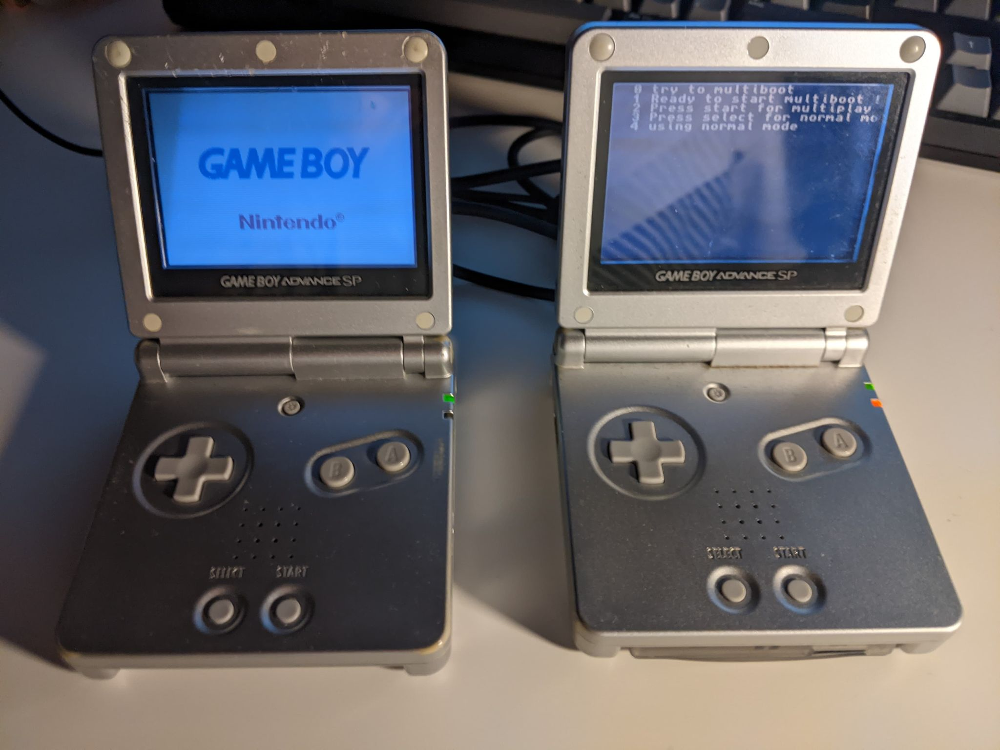
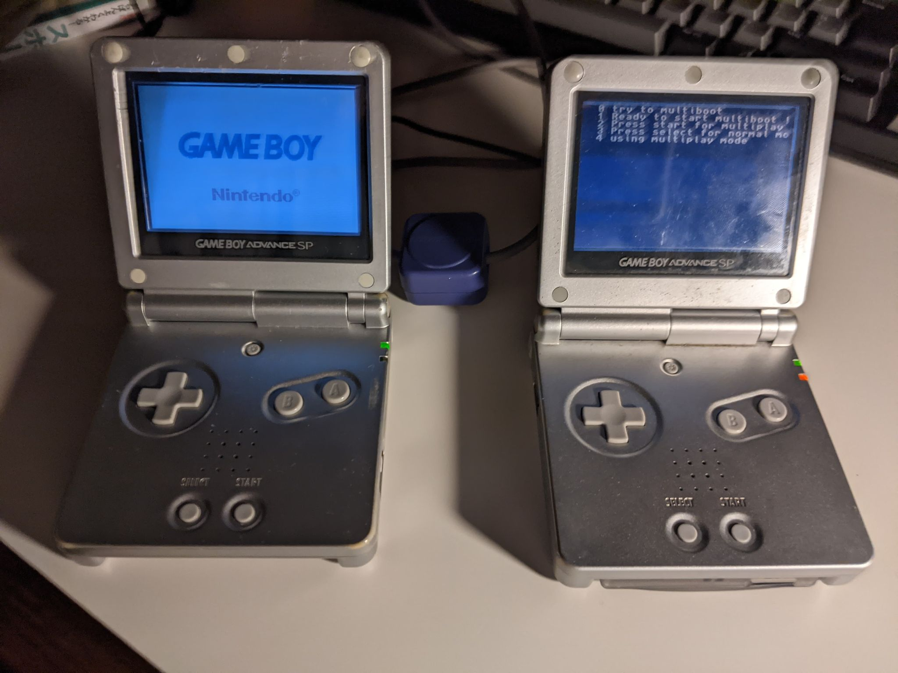
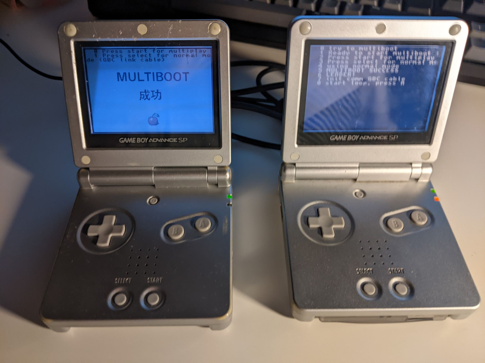
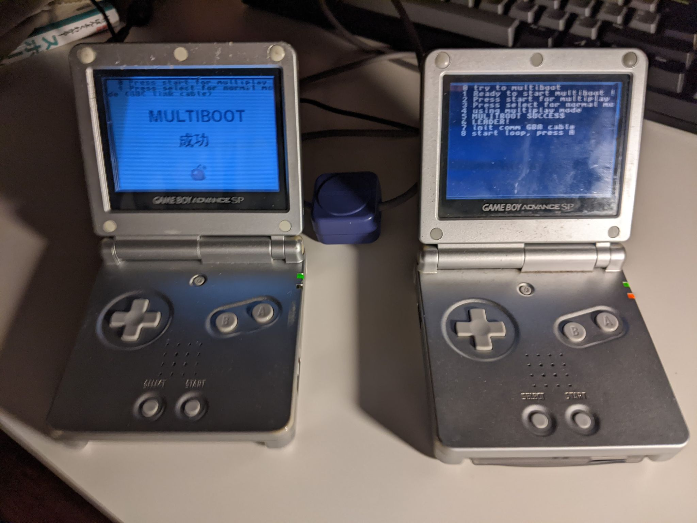

# gba-link

(English version below)

Cや[TONC](http://coranac.com/tonc/text/)を元にしたGBA用の通信ライブラリである。

本ライブラリを作るのに、afskaさんの実装を参考にした。 (https://github.com/afska/gba-link-connection)

レポジトリのテンプレート： https://github.com/gbadev-org/libtonc-template

このライブラリが提供してる機能が以下にある

- multiboot
  - 複数クライアントにmultiplay mode 経由でmultiboot（**GBA**用通信ケーブル）
  - 高周波数で単一クライアントにnormal mode 経由でmultiboot（**GB Color**用通信ケーブル CGB-003）
- 通信
  - multiplay mode でGBA四体までの"非同期"通信（**GBA**通信ケーブル）
  - normal mode でGBA <-> GBA 同期通信（**GBC**通信ケーブル）

source/main.c でサンプルコードとして、クライアントがmultiboot で起動した後に背景画像を設定する。
GBA間で通信の例として、Aボタンを押す時に他のGBAで反応するような簡単なプログラムが実行される。

|mode (通信ケーブル)|normal (CGB-003)|multiplay (AGB-005)|
|:--|:--|:--|
|multiboot中|||
|成功|||

---------

*English ver*

GBA simple link connection library using C and [TONC](http://coranac.com/tonc/text/).
Deeply inspired from afska's work: https://github.com/afska/gba-link-connection

- template from: https://github.com/gbadev-org/libtonc-template

Allows: 
- multiboot to several clients with multiplay mode (and a **GBA** link-cable)
- multiboot to one client at high speed with normal mode (and a **GBC** link-cable CGB-003)
- communication up to 4 GBAs in multiplay mode (**GBA** link cable)
- communication with another GBA in normal mode (**GBC** link cable)

The example in source/main.c displays an image as background on the client screen after multiboot, and GBAs can then interact with each other upon pressing A button.

TODO: add a decent HOW_TO
